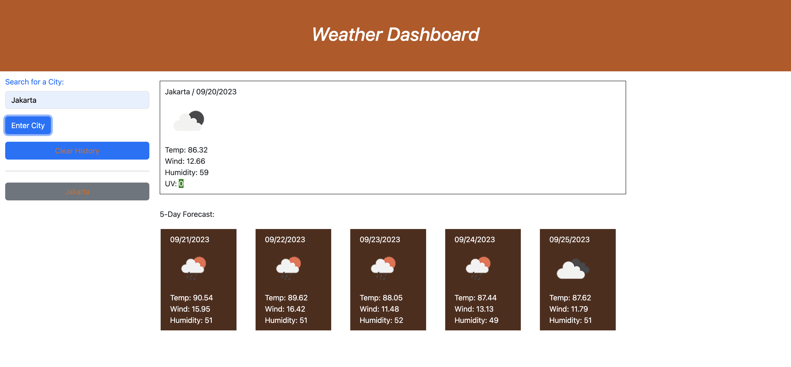

# Weather Dashboard

## Description

 Build a weather dashboard that will run in the browser and feature dynamically updated HTML and CSS. Server APIs allow access and making requests with specific parameters to a URL. A responsive Weather Dashboard that displays the weather with a 5-day forecast anywhere in the world when a city is searched. This app utilizes the Open Weather API, which provides temp, wind, humidity, and UV data. A history of the places searched is saved in local storage and displayed to be clicked and viewed again if needed. 


## Usage
[Checkout the project on Github ](https://github.com/noeamelya/weather_dashboard)

Outcome the project:



## Technologies

    * HTML
    * CSS/Bootstrap
    * Javascript
    * JQuery
    * API

## Installatin

```npm i```

## Mock-Up

The following image shows the web application's appearance and functionality:


## LICENSE
MIT

## Questions
Please contat me :

GitHub : https://github.com/noeamelya/


Email : noeamelyaofficial@hotmail.com


